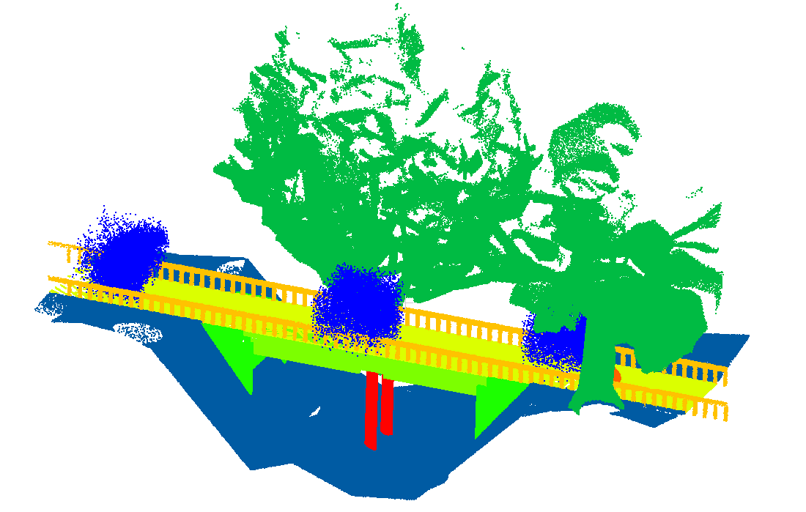
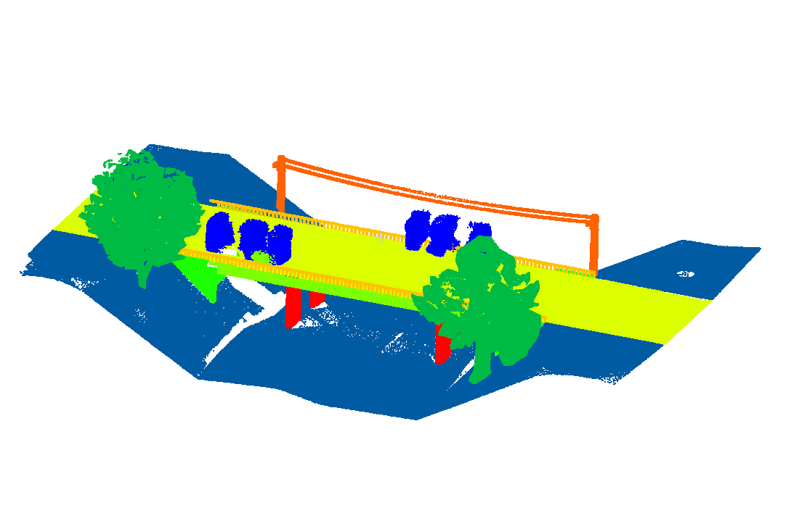
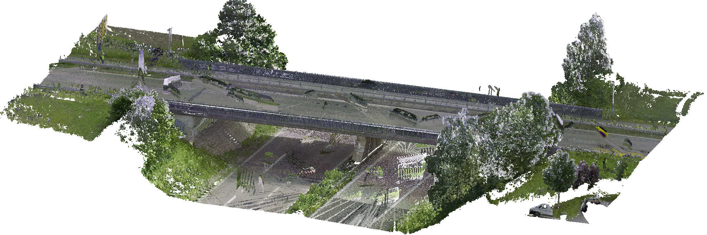
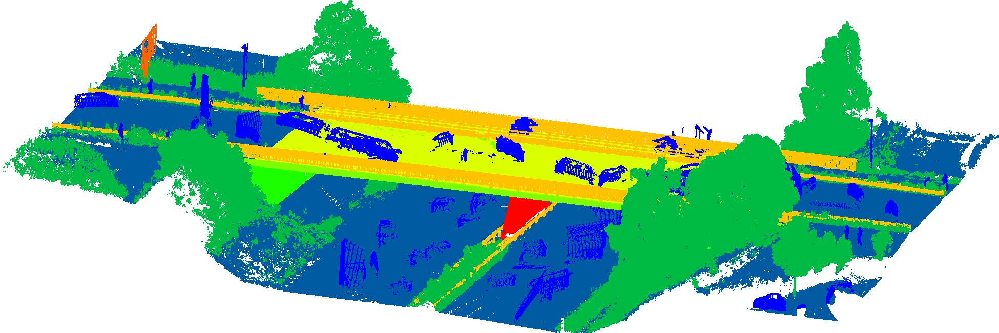

# 3d bridge segmentation

The objective of the present project is the automated creation of digital twins for existing bridge structures. To this end, the initial step involves semantic segmentation of the provided point clouds prior to subsequent processing. This repository contains:
1. A set of 23 synthetic bridges that were scanned and annotated automatically
2. A set of 20 real-world bridges scanned and manually annotated
3. Simple basic starting code to train 3 different 3D models for large 3D point cloud scenes

For more details we refer to the following two paper:
- [3D bridge segmentation using semi-supervised domain adaptation](https://www.sciencedirect.com/science/article/pii/S0926580525000615?via%3Dihub)
- [SemanticBridge - A Dataset for 3D Semantic Segmentation of Bridges and Domain Gap Analysis](https://arxiv.org/abs/2512.15369)

## Code

The code is containerized. For development, VS Code DevContainers can be used. Easily use the [Remote Development extension](https://marketplace.visualstudio.com/items?itemName=ms-vscode-remote.vscode-remote-extensionpack).

### Setup

Build the container with the tag <3d_bridge_segmentation>, rename the .devcontainer/devcontainer.example to .json. Update and mount your data-folder into the docker:
```JSON
	},
	// Uncomment to use the Docker CLI from inside the container. See https://aka.ms/vscode-remote/samples/docker-from-docker.
	"mounts": [
		"source=<path-to-data>,target=/data,type=bind"
	]
```

Afterwards, you have to compile the cuda/c++ dependencies:
```bash
cd lib/
./setup.sh
```

Configure the required config.yml file (examples can be found in config directory) and simply run:
```bash
python3 train.py <config.yml>
```

## Data

### Synthetic

In total, we offer 23 different scenes of bridges. For simplicity we focused on the following classes:

<center>

| ID | Class name | nr points |
| -------- | ------- | ------- |
| 0 | unlabeled | 628.371 |
| 1 | ground | 66.630.880 |
| 2 | high vegetation | 10.532.641 |
| 3 | abutment | 10.838.768 |
| 4 | superstructure | 42.497.680 |
| 5 | top surface | 48.302.362 |
| 6 | railing | 2.169.738 |
| 7 | traffic sign | 341.185 |
| 8 | pillar | 3.462.674 |

</center>

Two examples, colored according to their classes, are visualized below:

 

### Real

We scanned 20 real world bridges. 10 located in Germany and 10 in UK. In all cases a TLS scanner was used. Additionally we scanned 6 bridges with a MLS scanner.

<center>

| ID | Class name | TLS points | MLS points |
| -------- | ------- | ------- | ------- |
| 0 | unlabeled | 4.848.483 | 716.059 |
| 1 | ground | 106.884.341 | 29.217.777
| 2 | high vegetation | 45.193.593 | 19.097.682 |
| 3 | abutment | 8.994.167 | 2.575.750 |
| 4 | superstructure | 37.847.082 | 7.657.857 |
| 5 | top surface | 19.846.553 | 8.828.246 |
| 6 | railing | 11.715.179 | 3.905.237 |
| 7 | traffic sign | 223.234 | 155.333 |
| 8 | pillar | 9.544.994 | 397.365 |

</center>




### data split

The following real-world bridges are for testing purposes:
- bridge_1_cb_faro
- bridge_7_cb_faro
- bridge_13_fr_rtc/blk
- bridge_17_fr_rtc/blk
- bridge_19_fr_rtc/blk

### Download

The synthetic data can be downloaded via the [mobilithek](https://mobilithek.info/offers/829756627880919040).

The real data can be downloaded via the [mobilithek](https://mobilithek.info/offers/939531201542860800)

## Citation

This synthetic data was created for the work presented in [3D bridge segmentation using semi-supervised domain adaptation](https://www.sciencedirect.com/science/article/pii/S0926580525000615). The real world data are created in cooperation with the Department of Engineering, Cambridge. If you find our work useful in your research, please consider citing:

```
@article{SemanticBridge,
      title={SemanticBridge - A Dataset for 3D Semantic Segmentation of Bridges and Domain Gap Analysis}, 
      author={Maximilian Kellner and Mariana Ferrandon Cervantes and Yuandong Pan and Ruodan Lu and Ioannis Brilakis and Alexander Reiterer},
      year={2025},
      eprint={2512.15369},
      archivePrefix={arXiv},
      primaryClass={cs.CV},
      url={https://arxiv.org/abs/2512.15369}, 
}
```
```
@article{SynthBridge,
	title = {3D bridge segmentation using semi-supervised domain adaptation},
	journal = {Automation in Construction},
	volume = {172},
	pages = {106021},
	year = {2025},
	issn = {0926-5805},
	doi = {https://doi.org/10.1016/j.autcon.2025.106021},
	url = {https://www.sciencedirect.com/science/article/pii/S0926580525000615},
	author = {Maximilian Kellner and Timothy König and Jan-Iwo Jäkel and Katharina Klemt-Albert and Alexander Reiterer},
	keywords = {3D deep learning, Bridge segmentation, Point cloud generation, Point cloud processing, Domain adaptation},
}
```

## Models

### Sparse ResUNet

3D [UNet](https://lmb.informatik.uni-freiburg.de/Publications/2015/RFB15a/) with residual connections using sparse convolutions.

```
@misc{spconv2022,
    title={Spconv: Spatially Sparse Convolution Library},
    author={Spconv Contributors},
    howpublished = {\url{https://github.com/traveller59/spconv}},
    year={2022}
}
```

### KPConv

Kernel Point Convolution, which is a special designed point convolution operator for processing point clouds.

```
@article{thomas2019KPConv,
    Author = {Thomas, Hugues and Qi, Charles R. and Deschaud, Jean-Emmanuel and Marcotegui, Beatriz and Goulette, Fran{\c{c}}ois and Guibas, Leonidas J.},
    Title = {KPConv: Flexible and Deformable Convolution for Point Clouds},
    Journal = {Proceedings of the IEEE International Conference on Computer Vision},
    Year = {2019}
}
```

### Point Transformer V2

Transformer architecture designed specifically for point cloud data, updated with grouped attention and grid-based pooling.

```
@inproceedings{wu2022point,
  title     = {Point transformer V2: Grouped Vector Attention and Partition-based Pooling},
  author    = {Wu, Xiaoyang and Lao, Yixing and Jiang, Li and Liu, Xihui and Zhao, Hengshuang},
  booktitle = {NeurIPS},
  year      = {2022}
}
```
